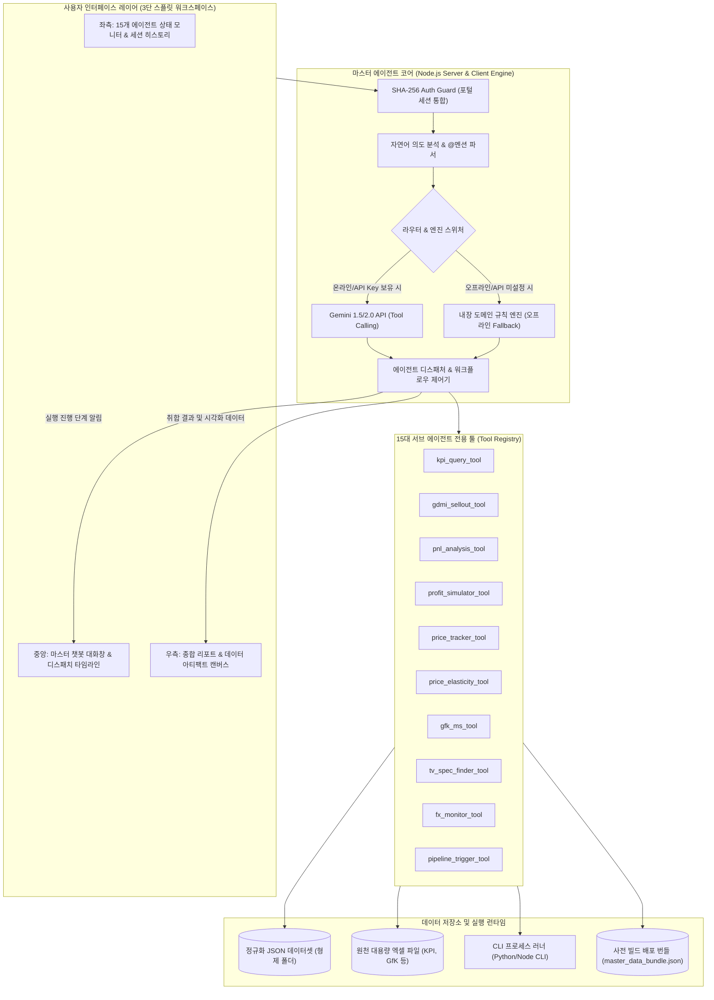

# [PRD] TV Europe Sales Master AI Agent 구축 요구사항 정의서
**Product Requirement Document: Multi-Agent Sales Orchestrator for TV Europe Portal**

- **작성일자**: 2026-09-16
- **대상 부서**: TV 유럽영업 / AX 실행과제 추진팀
- **프로젝트 코드**: `99. Master Agent`
- **버전**: v1.0.0 (Approved Architecture)

---

## 1. 개요 및 목적 (Executive Summary & Objectives)

### 1.1 배경
현재 'TV Europe Sales Management Portal' 산하에는 4대 영역(매출/손익, 제품 정보, 가격 관리, 시장 정보)에 걸쳐 총 15개 이상의 개별 대시보드와 데이터 파이프라인(서브 에이전트)이 구축되어 운영 중입니다. 각 에이전트는 원천 데이터(대용량 엑셀, GfK 리포트, 일일 웹 스크래핑 DB 등)를 기반으로 고도화된 개별 분석 기능을 제공하고 있으나, 다음과 같은 실무적 한계가 존재합니다.

1. **파편화된 정보 탐색 비용**: 특정 국가나 모델에 대한 종합 의사결정을 내리기 위해 실무자가 4~5개의 개별 대시보드를 일일이 열어보고 지표를 수동으로 조합해야 함.
2. **복합 시뮬레이션 연계의 부재**: 환율 변동(FX-Monitor)이나 가격 인상(Price Elasticity)이 전체 법인 손익(P&L) 및 선행 수익성에 미치는 영향을 교차 시뮬레이션하기 어려움.
3. **데이터 파이프라인 수동 트리거의 번거로움**: 신규 엑셀 업로드 시 각 폴더별 파이썬/노드 스크립트를 개별 터미널에서 실행해야 함.

### 1.2 구축 목적
본 프로젝트는 포털 산하 15개 전문 서브 에이전트의 데이터셋, 파이프라인 스크립트, 도메인 지식을 유기적으로 연결하여, 사용자의 자연어 요청을 해석하고, 필요한 에이전트들에 업무를 자동 배분(Dispatch)하며, 산출된 결과를 종합·요약하여 브리핑하는 **'올인원 전략 영업 참모형 마스터 에이전트(Master AI Agent)'**를 구축하는 것을 목표로 합니다.

---

## 2. 15대 서브 에이전트 도메인·기능·데이터베이스 전수 분석

마스터 에이전트가 통제하고 연동할 15개 전문 서브 에이전트의 상세 명세는 다음과 같습니다.

| No | 에이전트 명칭 | 카테고리 | 갱신 주기 | 핵심 업무 영역 및 주요 기능 | 원천 DB 및 데이터 파일 경로 | 배포 Web URL / 런타임 |
|:---|:---|:---|:---:|:---|:---|:---|
| **01** | **Daily Sales Progress** | 매출/손익 | 일간 (Daily) | 유럽 전 권역 및 18개 법인별 당월 매출 실시간 진척률, 일일 출하 및 Run-rate 모니터링 | 사내 HedEj API, 실시간 집계 DB | `https://eucisdailysales.apps.hedej.lge.com/` |
| **02** | **KPI Sheet** | 매출/손익 | 주간 (Weekly) | 21개 지사/지점별 매출 실적, Sell-in/out, 신모델 비중, 유통 재고, WOS(-4) 및 3대 지표 종합 관리 | `26년_유럽+CIS_KPI_2026.xlsx`, `build_metrics.json`, `executive_insights.json` | `https://kpi-sheet-europe-2026.web.app` (Node.js/JS) |
| **03** | **TV P&L Analysis** | 매출/손익 | 월간 (Monthly) | Gross/Net 매출, 매출원가, 판촉비(BTL), 한계이익, 영업이익 심층 분석 및 법인별 손익 트렌드 | `core/`, `run_pnl_pipeline.py`, 법인별 P&L 엑셀 및 JSON | `https://lge-tv-pnl-2026.web.app` (Python/Flask/Static) |
| **04** | **GDMI Weekly Sellout** | 매출/손익 | 주간 (Weekly) | 주차별 유럽 15개국 법인/유통 주간 Sellout 실적, 인치별/시리즈별 판매 추이 및 유통 재고 분석 | `export_normalized_metrics.py`, `00. Raw Data/`, `_data/` | `https://gdmi-weekly-dashboard.web.app` (Python/JS) |
| **05** | **선행 수익성 분석** | 매출/손익 | 월간/수시 | 신규 수주 및 출하 전 시나리오별 선행 이익률 예측, 타당성 검증, 리스크 수주 필터링 | `advance_profitability_data.json`, `build_from_source_sheets.js`, `선행수익성 자료/` | `https://lge-advance-profitability-2026.web.app` (Node.js) |
| **06** | **수익성 Simulator** | 매출/손익 | 월간/수시 | 환율(FX), 제조원가, 유통 장려금(Rebate) 변동에 따른 21개 법인 민감도 시뮬레이션 및 손익 예측 | `simulator_data.json`, `simulator_engine.js`, `build_simulator_data.js` | `https://lge-profitability-simulator-2026.web.app` (Node.js) |
| **07** | **PRM 상담자료 (2025/26)** | 제품 정보 | 연간/상시 | 유럽 거래선 미팅용 실적 리뷰(OLED M/S 51%), 2026 전략 로드맵(Wallpaper 9.9mm), 48장 HD 슬라이드 뷰어 | `published/2025-prm-consulting/`, `chatbotEngine.js`, 155개 모델 SPEC DB | `https://lge-product-showcase-2026.web.app/docs/2025-prm-consulting/` |
| **08** | **TV PRM (로드맵)** | 제품 정보 | 월간 | TV 연간 모델 라인업 출시 일정, 시리즈별 출시 캘린더 및 세그먼트 스펙 | `07. 제품 소개 사이트.../extract_spec_dataset.js` | `https://lge-product-showcase-2026.web.app` |
| **09** | **Spec Sheet Finder** | 제품 정보 | 수시 | OLED/QNED/NanoCell 모델별 세부 하드웨어 스펙 비교 매트릭스 (155개 모델 x 146개 스펙 항목) | `published/2026-tv-spec-finder/`, 엑셀 SPEC DB | `https://lge-product-showcase-2026.web.app` |
| **10** | **TV Product Profile** | 제품 정보 | 월간 | 전략 모델 및 시리즈별 USP, 셀링 포인트, 주요 유통 타깃 사양 프로파일 | `07. 제품 소개 사이트.../public/` | `https://lge-product-showcase-2026.web.app` |
| **11** | **거래선 방한 캘린더** | 제품 정보 | 실시간 | 유럽/CIS 주요 거래선 방한 일정, 본사 미팅 스케줄 및 VIP 상담 이력 통합 관리 | 사내 HedEj 캘린더 API | `https://dealertrip.apps.hedej.lge.com/` |
| **12** | **Price Tracker** | 가격 관리 | 일간 (Daily) | 유럽 11개국 온/오프라인 유통 실시간 판매가(ASP) 스크래핑, 1:1 라인업 매칭, Price Gap 및 최저가 추적 | `History_EU/`, `data/`, Playwright/Python 크롤러 DB | `https://eu-price-tracker-lge.web.app` (Python/Playwright) |
| **13** | **ATA Guide** | 가격 관리 | 월간/수시 | Authorization To Act / 권역별 최저 승인 판매 가격 가이드라인 및 승인 현황 조회 | `published/docs/ata-guide/` | `https://lge-product-showcase-2026.web.app/docs/ata-guide/` |
| **14** | **가격 탄력성 시뮬레이터**| 가격 관리 | 월간 | 18개월 유럽 20개국 패널 회귀분석 기반 가격 인상률에 따른 판매량 변화 및 4대 경쟁 대응 시뮬레이션 | `12. 가격 탄력성 회귀분석/DATA/`, 계량경제 회귀식 | `https://lge-price-elasticity-2026.web.app` (Python/JS) |
| **15** | **GfK Monthly Report** | 시장 정보 | 월간 (Monthly) | 유럽 15개국 GfK 월간 시장 실판매(Sellout), 시장 규모, 브랜드별/인치별 점유율 리포트 | `00. GFK Report/`, 국가별 엑셀 시트 | `https://gfk-report-monthly-lge.web.app` (Node.js/JS) |
| **16** | **M/S Trend** | 시장 정보 | 주간 (Weekly) | 경쟁사(삼성, 소니, TCL, 하이센스) 대비 주차별 Market Share 트렌드 및 인치대별 점유율 비교 | `ms_trend_data.json`, `ms_trend_insights.json`, `run_pipeline.py` | `https://tv-ms-trend-dashboard.web.app` (Python/JS) |
| **17** | **FX-Monitor** | 시장 정보 | 실시간 (Live) | EUR, USD, GBP, PLN 등 주요 통화 실시간 환율 추이, 연초 사업계획 대비 환변동 리스크 모니터링 | `03. FX-Monitor-main/data/`, 환율 API | `https://fx-tracker-4f44c.web.app` (Python/FastAPI) |
| **18** | **Weekly MS Analysis** | 시장 정보 | 주간 (Weekly) | 유럽 GfK 주간 실판매 요약(Summary W35 등) 및 3대 핵심국가(FR, GB, IT) 주간 MS 분석 | `☆2026 EU GfK Weekly Summary(~W35)_Pre.xlsx`, `run_weekly_pipeline.py` | Python Pipeline |

---

## 3. 시스템 아키텍처 및 연동 설계 (System Architecture)

### 3.1 하이브리드 오케스트레이션 아키텍처 (Hybrid Orchestration)
마스터 에이전트는 **Google Gemini API(Function Calling)** 기반의 지능형 라우팅과, 네트워크 단절이나 API 키 부재 시에도 안정적으로 구동되는 **내장 도메인 규칙/데이터 매칭 엔진(Local Fallback Rule Engine)**을 결합한 하이브리드 구조로 설계됩니다.

### 3.2 듀얼 런타임 배포 전략 (Dual Runtime Strategy)
1. **로컬 개발/업무 런타임 (Node.js Express Server Mode)**:
   - `server.js` 구동 (`http://localhost:5000` 등)
   - 로컬 형제 디렉토리(`01. GDMI` ~ `13. weekly MS`)의 최신 엑셀/JSON 데이터를 실시간 파일 시스템(FS)으로 직접 인덱싱 및 핫 리로딩
   - `child_process.spawn`을 통해 엑셀 데이터 가공 파이프라인(`run_pipeline.py`, `build_dashboard.js` 등)을 실제 CLI로 직접 실행 및 실시간 터미널 로그 스트리밍 지원
2. **웹 호스팅 배포 런타임 (Firebase Static Hosting Mode)**:
   - `build_bundle.js` 스크립트를 통해 15개 에이전트의 핵심 지표 데이터를 단일 정규화 번들(`master_agent_bundle.json`)로 자동 취합 압축
   - 백엔드 없이 순수 HTML/JS 정적 웹 사이트로 Firebase에 원클릭 배포
   - 브라우저 클라이언트에서 Gemini API를 직접 호출하거나 로컬 규칙 엔진으로 즉각 동작

---

## 4. 핵심 기능 요구사항 (Functional Requirements)

### 4.1 대화형 인터페이스 및 라우팅 (Chat & Dispatch)
- **FR-1.1 자연어 복합 의도 파악**: 사용자가 입력한 자연어 문장에서 국가(독일, 프랑스, 영국 등), 모델 라인업(OLED C4, G4, QNED), 지표(매출, 최저가, 마진, 점유율, WOS)를 엔티티로 자동 추출하고 관련 서브 에이전트를 다중 선별.
- **FR-1.2 `@멘션` 직접 호출**: 
  - `@KPI`, `@P&L`, `@PriceTracker`, `@Simulator`, `@GDMI`, `@GfK`, `@Spec`, `@FX` 등의 키워드를 입력 시 해당 에이전트에게 우선적으로 작업을 할당하고 전문 상담 모드 실행.
- **FR-1.3 실시간 업무 분배 타임라인 (Dispatch Timeline)**:
  - 챗봇 답변 생성 시 서브 에이전트 호출 단계(예: `[1/3] Price Tracker에서 최저가 조회 중...` -> `[2/3] KPI Sheet에서 독일 재고 주수 확인 중...` -> `[3/3] 종합 결과 취합 및 리포트 작성 중`)를 시각적 프로그레스 바로 투명하게 표시.

### 4.2 올인원 영업 참모형 4대 핵심 역량 (Core Capabilities)
- **FR-2.1 크로스 도메인 교차 분석 및 종합 브리핑**:
  - 단일 질의로 GDMI(판매량) + Price Tracker(온라인 최저가) + KPI Sheet(WOS 재고) + TV P&L(수익성) 데이터를 종합한 원스톱 브리핑 제공.
  - *예시*: "독일(DG) 65인치 OLED의 이번 주 실적과 경쟁 상황 어때?" -> 판매량 추이, 최저가 Price Gap(삼성 대비), 재고 주수 위험도, 영업이익률 현황을 요약 표와 함께 브리핑.
- **FR-2.2 대화형 복합 시나리오 시뮬레이션**:
  - 챗봇 대화창에서 파라미터(환율 변동, 유통 장려금율, 가격 변동폭)를 입력받아 '수익성 Simulator' 및 '가격 탄력성 모델'을 연동 실행하고, 예상 매출액 및 한계이익률 변동 결과를 우측 캔버스에 시각화.
- **FR-2.3 데이터 갱신 파이프라인 실행 제어 (CLI Pipeline Trigger)**:
  - 사용자의 요청에 따라 각 폴더의 파이썬/노드 파이프라인 스크립트를 백엔드에서 실행.
  - **안전 확인 장치(Safety Prompt)**: 대용량 데이터 갱신 및 파일 덮어쓰기 작업 전, 영향 범위(대상 엑셀/JSON)와 예상 소요 시간을 팝업으로 안내하고 사용자의 명시적 승인 버튼 클릭 시에만 실행.
- **FR-2.4 경영진 보고용 Executive Briefing 자동 생성**:
  - 주간/월간 단위로 전체 유럽 권역의 매출, 수익성, 시장 점유율, 가격 리스크를 총망라한 경영진 보고서(Markdown/Printable HTML) 원클릭 생성.

### 4.3 3단 스플릿 워크스페이스 UI/UX (Layout Specifications)
- **좌측 사이드바 (Navigation & Monitor, 폭: 280px)**:
  - 포털 복귀 링크 (`← TV Europe Portal`)
  - 15대 서브 에이전트 실시간 가동 상태 인디케이터 (초록색 불: 데이터 최신, 노란색: 업데이트 대기)
  - 대화 세션 히스토리 목록 (새 세션 생성, 과거 대화 로드/삭제)
  - 퀵 프롬프트 추천 칩 (자주 묻는 질문 템플릿)
- **중앙 워크스페이스 (Chat & Orchestration, 가변 폭)**:
  - 마스터 에이전트 실시간 채팅 스트림
  - 서브 에이전트 추론 및 디스패치 카드 (아코디언 토글)
  - 프롬프트 입력창 (멀티라인 지원, `@멘션` 자동완성, 첨부/초기화 버튼)
- **우측 캔버스 (Live Artifact & Report Canvas, 폭: 500px ~ 650px 또는 토글)**:
  - 챗봇이 생성한 정밀 데이터 표, 차트(Chart.js), 시뮬레이션 인터랙티브 슬라이더, 종합 보고서 렌더링
  - 상단 액션 툴바: [마크다운 복사], [인쇄/PDF 저장], [CSV 엑셀 다운로드], [전체화면 확대]

### 4.4 보안 및 인증 (Security & Persistence)
- **FR-3.1 포털 통합 인증(LGE SHA-256 Auth-Guard) 호환**:
  - 기존 포털의 SHA-256 인증 세션(`lge_portal_authenticated_user`, 유효기간 30분)과 100% 호환되어, 포털 로그인 상태 시 별도 추가 로그인 없이 즉시 사용.
- **FR-3.2 대화 및 작업 이력 보존**:
  - 브라우저 IndexedDB 및 LocalStorage를 활용하여 세션별 대화 내역, 생성된 아티팩트 리포트 자동 저장.

---

## 5. 비기능 요구사항 (Non-Functional Requirements)

1. **디자인 시스템 표준 준수**:
   - `global-design-system` 지침 상속: Primary Slate (`#0F172A`), Secondary Teal (`#0D9488`), LG Accent Red (`#A50034`), Surface (`#FFFFFF`), Canvas (`#F8FAFC`).
   - 타이포그래피: 영문/국문 `Inter`, 코드/수치 `JetBrains Mono`, 헤딩 `IBM Plex Sans`.
2. **응답 속도 및 퍼포먼스**:
   - 로컬 규칙 엔진 응답: 500ms 이내
   - Gemini API 스트리밍 응답: 최초 토큰 2초 이내 출력 시작
   - 캔버스 대용량 테이블 렌더링: 1초 이내 가상화 스크롤 처리
3. **무중단 내구성 (Resilience)**:
   - 외부 인터넷 단절 또는 Gemini API 호출 할당량 초과 시, 자동으로 '로컬 오프라인 모드'로 스위칭되어 기 색인된 JSON 데이터 기반의 정형 질의응답을 정상 제공.
4. **글로벌 에이전틱 규칙 준수**:
   - 대용량 엑셀 데이터 접근 시 COM 셀 단위 루프 절대 금지 (기존 Rule 1/2 준수, 판다스/정규화 JSON 일괄 처리).

---

## 6. 잠재적 이슈, 리스크 및 사전 해결 방안 (Risk Management)

| No | 잠재적 리스크 및 이슈 | 영향도 | 사전 기술적 대응 및 해결 방안 |
|:---|:---|:---:|:---|
| **01** | **대용량 엑셀 COM 프로세스 락(Lock) 및 충돌** | 높음 | 실시간 대화 응답 시 원천 엑셀 파일을 직접 열지 않고, 각 에이전트가 사전 생성해 둔 정규화 JSON 캐시(`build_metrics.json`, `simulator_data.json` 등)를 1차 참조하도록 설계. 엑셀 재계산 파이프라인은 사용자가 명시적으로 승인한 경우에만 백그라운드 독립 프로세스로 구동. |
| **02** | **Firebase 정적 배포 시 로컬 스크립트 실행 불가** | 중간 | 웹 호스팅 배포 모드(Firebase)에서는 클라이언트 중심 조회/시뮬레이션을 지원하고, CLI 파이프라인 실행 요청 시 "로컬 데스크톱 서버(Node.js) 모드에서만 지원되는 기능입니다" 안내 및 로컬 구동 가이드 팝업 노출. |
| **03** | **15개 에이전트 간 데이터 갱신 시점(As-Of Date) 불일치** | 중간 | Daily(가격/일일매출), Weekly(GDMI/KPI), Monthly(P&L/GfK)의 갱신 시점이 상이하므로, 마스터 브리핑 리포트 출력 시 각 데이터 소스별 최신 갱신일시(`as-of: YYYY-MM-DD`)를 태그 배지로 명확히 표기하여 사용자의 혼선 방지. |
| **04** | **대용량 데이터 조회 시 LLM 컨텍스트 윈도우 초과/비용 증가** | 중간 | 전체 원천 엑셀을 LLM에 직접 주입하지 않고, 마스터 에이전트의 툴(Tool)이 질의 조건에 맞는 데이터만 필터링/집계(Aggregation)하여 경량 요약 JSON 형태로 LLM에 전달하는 구조 적용. |
| **05** | **사내 보안 및 Gemini API 키 노출 방지** | 높음 | 로컬 서버 모드에서는 `.env` 환경변수를 통해 서버 사이드에서만 API 키를 제어하고 클라이언트 노출을 차단. 웹 정적 모드에서는 사용자가 브라우저 설정 모달을 통해 자신의 Gemini API Key를 직접 입력(LocalStorage 로컬 저장)하여 구동하는 안전한 클라이언트 키 관리 제공. |

---

## 7. 구축 로드맵 및 마일스톤 (Implementation Roadmap)

1. **Phase 1: 기반 인프라 및 서브 에이전트 데이터 인덱서 구축 (Days 1~2)**
   - `99. Master Agent` 프로젝트 구조화 (Node.js 백엔드 `server.js` + 정적 웹 뷰)
   - 15개 서브 에이전트의 데이터 파일 자동 수집 및 정규화 인덱서(`agentRegistry.js`) 구현
   - 번들 빌더(`build_bundle.js`) 구축
2. **Phase 2: 오케스트레이션 코어 & 도구(Tool) 레지스트리 개발 (Days 3~4)**
   - Gemini Function Calling 툴 정의 (10대 핵심 툴: KPI, P&L, Price, GfK, Simulator 등)
   - 오프라인 지원용 로컬 룰/데이터 매칭 엔진(`localRuleEngine.js`) 개발
   - CLI 파이프라인 안전 실행 러너 구현
3. **Phase 3: 3단 스플릿 워크스페이스 UI/UX 및 아티팩트 캔버스 구현 (Days 5~6)**
   - 반응형 3단 레이아웃 마크업 및 Tailwind/Stitch 디자인 토큰 적용
   - 마스터 챗봇 인터페이스, 디스패치 타임라인 프로그레스 애니메이션
   - 아티팩트 캔버스 (표 렌더러, Chart.js 그래프, 인쇄/PDF/CSV 내보내기 기능)
   - 포털 통합 인증(SHA-256 Auth Guard) 연동
4. **Phase 4: 통합 검증, 복합 시나리오 테스트 및 Firebase 배포 (Day 7)**
   - 교차 도메인 실무 질의 테스트 (독일 OLED 실적 종합 질의 등 10개 시나리오)
   - 시뮬레이터 연동 및 파이프라인 실행 안전성 검증
   - Firebase 배포 및 포털 메인 메뉴 링크 연결
